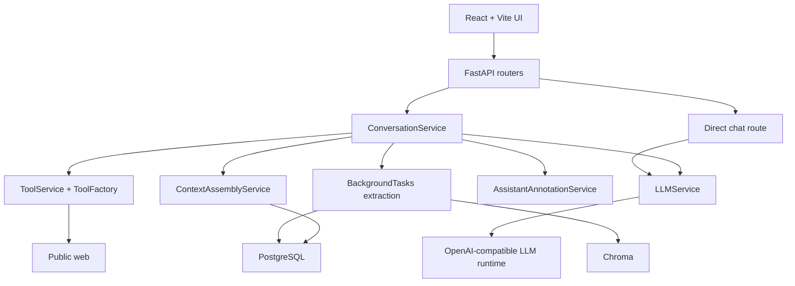

# Family AI Assistant Architecture

## Current Scope

The current product is a self-hosted, multi-user text assistant.
It is centered on trustworthy conversation replies, not a general multimodal agent platform.

Today the shipped system includes:

- Google-authenticated multi-user chat
- canonical transcript storage in PostgreSQL
- bounded context assembly from recent turns, one latest conversation summary, and per-user durable facts
- a shared LLM completion seam used by both direct chat and conversation replies
- a bounded native tool loop with `web_search` and `web_fetch`
- persisted assistant `annotations` for trust metadata and evidence
- desktop trust UI with an inline trust row and evidence panel

## Upcoming Scope (Active Development)

We are currently rolling out real-time streaming for assistant replies:

- **SSE Infrastructure:** Application-level SSE protocol and encoder to deliver structured events (`thought`, `token`, `done`, `error`) to the frontend.
- **Incremental LLM Parsing:** `LLMService` support for consuming raw provider streams and parsing reasoning segments (thoughts) from user content.
- **Delivery Verification:** A `/api/v1/chat/debug-stream` endpoint for verifying the end-to-end SSE delivery pipeline.

## High-Level Architecture

## Conversation Request Flow

1. The conversation API persists the user message in PostgreSQL.
2. `ContextAssemblyService` loads the latest conversation summary, relevant per-user durable facts, and a capped recent-turn window from Postgres.
3. `LLMService` sends the prepared prompt to the configured OpenAI-compatible model.
4. If the model requests a tool, `ToolService` executes the allowlisted tool and feeds structured output back through the bounded tool loop.
5. `AssistantAnnotationService` builds compact persisted annotations from tool usage, fetched evidence, and memory hits.
6. The assistant row is persisted with final content, any terminal failure detail, and the stored annotations payload.
7. On successful replies, a background task extracts refreshed summary and durable-fact memory, writes them to Postgres, and mirrors saved text into Chroma for retrieval support.

## Storage Model

### Canonical PostgreSQL tables

- `conversations` and `messages` store transcript history
- assistant `messages` also store nullable `annotations`
- `conversation_memory_summaries` stores one latest summary per conversation
- `durable_facts` stores per-user memory facts with source metadata and active/inactive state

### Retrieval support

Chroma is not the source of truth.
Saved summaries and durable facts are mirrored into Chroma only to support later retrieval and ranking workflows.

### Schema evolution

Alembic is the migration path for existing databases.
The app still bootstraps missing base tables at startup for empty local environments, but schema changes should be applied through Alembic migrations.

## Trust and Evidence Model

Assistant annotations are the reload-safe source for UI provenance.
The stored payload can include:

- fetched evidence sources
- tools used and whether they completed or failed
- memory hits injected into prompt assembly
- memory saved after background extraction
- terminal failure metadata

The frontend never regenerates this trust metadata client-side.
It renders what the backend persisted on the assistant message.

## Target Architecture: Streaming Response Lifecycle

Once fully integrated, the system will support real-time delivery of assistant responses using Server-Sent Events (SSE):

1. **Incremental Parsing:** `LLMService` consumes the raw LLM stream, and `StreamParser` distinguishes between reasoning traces (thoughts) and user-visible content.
2. **App-Level SSE Protocol:** The backend translates internal chunks into a structured app-level protocol (`thought`, `token`, `tool_call`, `done`, `error`) using `SSEEncoder`.
3. **Persistence Timing:** User messages are persisted immediately to ensure durable history. Assistant messages are persisted only after the stream reaches a terminal state, capturing the full content and reasoning trace.
4. **UI Updates:** The frontend hook consumes the SSE stream, updating the UI in real-time while distinguishing between reasoning and final content.

## Current Boundaries

The shipped architecture intentionally does not include:

- full end-to-end streaming of conversation replies (currently in progress)
- image, audio, or video generation
- Google Drive ingestion
- household shared-memory features
- mobile-specific trust detail surfaces

Those follow-on items are tracked in [TODOS.md](../TODOS.md).
