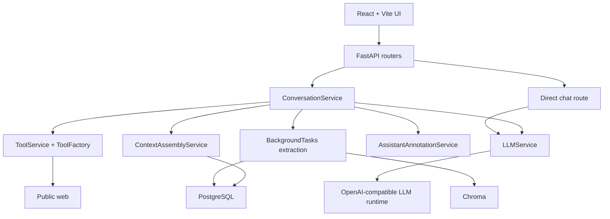

# Family AI Assistant Architecture

## Current Scope

The current product is a self-hosted, multi-user text assistant.
It is centered on trustworthy conversation replies, not a general multimodal agent platform.

Today the shipped system includes:

- Google-authenticated multi-user chat
- canonical transcript storage in PostgreSQL
- bounded context assembly from recent turns, one latest conversation summary, and per-user durable facts
- a shared LLM completion seam used by both direct chat and conversation replies
- a bounded native tool loop with `web_search` and `web_fetch`
- persisted assistant `annotations` for trust metadata and evidence
- desktop trust UI with an inline trust row and evidence panel

## Recently Shipped

Real-time streaming for assistant replies is now complete:

- **SSE Infrastructure:** Application-level SSE protocol delivers structured events (`thought`, `token`, `tool_call`, `meta`, `done`, `error`) to the frontend.
- **Incremental LLM Parsing:** `LLMService` consumes raw provider streams and parses reasoning segments (thoughts) from user content.
- **Streaming Tool Loop:** tool calls emitted during streaming are executed in-stream, their results are fed back to the model, and tool lifecycle state is surfaced in the UI.
- **Token Limit Handling:** Backend tracks `finish_reason` from LLM, persists in annotations, enables Continue button in UI when responses truncate due to length.
- **Cancellation Support:** the chat composer exposes a `Stop` button during active streams, which aborts the SSE request and lets the backend persist truthful terminal state.
- **Delivery Verification:** `/api/v1/chat/debug-stream` endpoint verifies end-to-end SSE delivery pipeline.

## High-Level Architecture

## Conversation Request Flow

1. The conversation API persists the user message in PostgreSQL.
2. `ContextAssemblyService` loads the latest conversation summary, relevant per-user durable facts, and a capped recent-turn window from Postgres.
3. `LLMService` sends the prepared prompt to the configured OpenAI-compatible model.
4. If the model requests a tool, `ToolService` executes the allowlisted tool and feeds structured output back through the bounded tool loop.
5. `AssistantAnnotationService` builds compact persisted annotations from tool usage, fetched evidence, and memory hits.
6. The assistant row is persisted with final content, any terminal failure detail, and the stored annotations payload.
7. On successful replies, a background task extracts refreshed summary and durable-fact memory, writes them to Postgres, and mirrors saved text into Chroma for retrieval support.

## Storage Model

### Canonical PostgreSQL tables

- `conversations` and `messages` store transcript history
- assistant `messages` also store nullable `annotations`
- `conversation_memory_summaries` stores one latest summary per conversation
- `durable_facts` stores per-user memory facts with source metadata and active/inactive state

### Retrieval support

Chroma is not the source of truth.
Saved summaries and durable facts are mirrored into Chroma only to support later retrieval and ranking workflows.

### Schema evolution

Alembic is the migration path for existing databases.
The app still bootstraps missing base tables at startup for empty local environments, but schema changes should be applied through Alembic migrations.

## Trust and Evidence Model

Assistant annotations are the reload-safe source for UI provenance.
The stored payload can include:

- fetched evidence sources
- tools used and whether they completed or failed
- memory hits injected into prompt assembly
- memory saved after background extraction
- terminal failure metadata

The frontend never regenerates this trust metadata client-side.
It renders what the backend persisted on the assistant message.

## Streaming Response Lifecycle

The system supports real-time delivery of assistant responses using Server-Sent Events (SSE):

1. **Incremental Parsing:** `LLMService` consumes the raw LLM stream, and `StreamParser` distinguishes between reasoning traces (thoughts) and user-visible content.
2. **App-Level SSE Protocol:** The backend translates internal chunks into a structured app-level protocol (`thought`, `token`, `tool_call`, `meta`, `done`, `error`) using `SSEEncoder`.
3. **Token Limit Handling:** Backend enforces `LLM_MAX_TOKENS` (default: 1024), captures `finish_reason` from LLM, persists in `AssistantAnnotations`. When `finish_reason === 'length'`, frontend displays truncation indicator and Continue button.
4. **Persistence Timing:** User messages are persisted immediately to ensure durable history. Assistant messages are persisted only after the stream reaches a terminal state, capturing the full content, reasoning trace, and finish_reason.
5. **Streaming Tool Execution:** Conversation streaming can execute allowlisted tools between stream rounds, emit tool lifecycle events, and continue the assistant turn with tool results included in prompt state.
6. **UI Updates:** The frontend hook consumes the SSE stream, updating the UI in real-time while distinguishing between reasoning and final content. While a stream is active, the composer shows a `Stop` action that aborts the request.

## Current Boundaries

The shipped architecture intentionally does not include:

- image, audio, or video generation
- Google Drive ingestion
- household shared-memory features
- mobile-specific trust detail surfaces

Those follow-on items are tracked in [TODOS.md](../TODOS.md).
