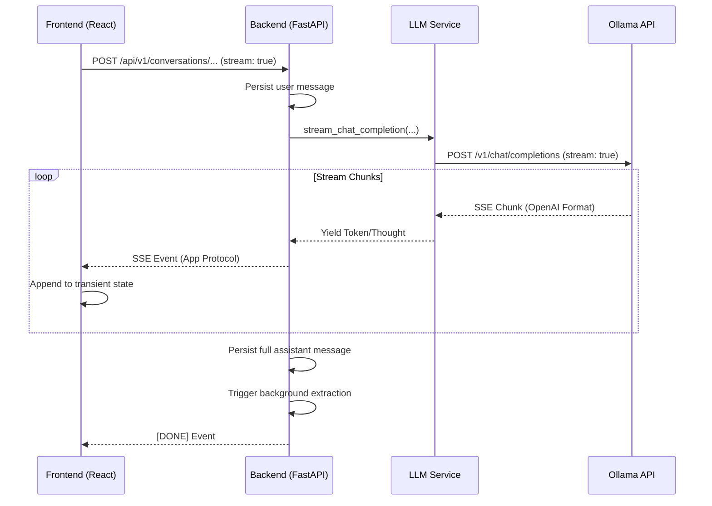

# Streaming Responses PRD

## Summary

This document defines the implementation plan for real-time streaming
responses in Family Assistant.

The product goal is to eliminate long wait times for assistant replies,
especially for reasoning-heavy or complex models, by delivering content to
the user as it is generated.

## Product Goals

- Support real-time streaming of assistant responses in the chat UI.
- Use Server-Sent Events (SSE) for efficient, one-way streaming from
  backend to frontend.
- Maintain support for tool calling and background memory extraction
  within the streaming flow.
- Provide a responsive UI that handles partial content, thought traces,
  and final completion states.
- Ensure messages are correctly persisted to Postgres once the stream is
  complete.

## Non-Goals

- Implementing full bidirectional WebSockets (not needed for this use
  case).
- Refactoring the entire database schema (streaming metadata can live in
  the existing `annotations` or metadata fields).
- Supporting multi-user collaborative editing of the same stream.

## Problem Statement

The current backend is entirely non-streaming. When a user sends a message:
1. The backend makes a blocking call to the LLM.
2. The LLM generates the full response (often taking 10-60+ seconds).
3. The backend returns the final result.
4. The user sees a loading spinner for the entire duration.

This leads to a poor user experience, especially with local models or
reasoning modes (like "Thinking" mode) where the time-to-first-token is
high.

## Key Technical Observations

### Server-Sent Events (SSE) are the right fit
Since the assistant response is a one-way stream of data from the server
to the client, SSE is simpler to implement and maintain than WebSockets
while being more efficient than long polling.

### Tool calls must be handled carefully
Streaming complicates tool-calling loops. The system must decide when to
emit tokens to the user and when to pause for tool execution.
Initially, we may stream the reasoning/content until a tool call is
identified, execute the tool, and then continue streaming the next turn.

### Persistence happens at the end
To maintain a consistent history, messages should be saved to the
canonical Postgres database only after the stream has successfully
finished. Partial/interrupted streams should be handled gracefully.

### Streaming reasoning vs. content
For models that emit reasoning traces (like DeepSeek-R1 or Gemma thinking),
the stream should distinguish between thought tokens and final content
tokens so the UI can render them differently.

## Proposed Solution

### Backend: Streaming LLM Service
Refactor `LLMService` to support a streaming mode that yields tokens from
the Ollama/OpenAI API.

### Backend: Streaming Conversation Service
Introduce a new endpoint or update existing ones to return a
`StreamingResponse` (FastAPI).

New endpoint structure (conceptual):
```text
POST /api/v1/conversations/{id}/messages/stream
```

### Backend: Event Protocol
Define a clear SSE event protocol:
- `token`: Partial content or reasoning token.
- `tool_call`: Metadata about a tool being executed.
- `done`: Final completion metadata, including full content for
  persistence.
- `error`: Terminal failure information.

### Frontend: Streaming API Client
Update the frontend API client (e.g., using `fetch` with `ReadableStream`)
to consume the SSE stream and update the application state in real-time.

### Frontend: UI Feedback
Update `Chat.tsx` and `ConversationsChat.tsx` to:
- Show an active streaming state for the latest assistant message.
- Render content as it arrives.
- Distinguish between reasoning traces and final content.

## Architecture Changes

### New concepts
- `StreamingLLMService`
- `SSEProtocol`
- `StreamingState` (Frontend)

### Existing areas touched
- `apps/assistant-backend/src/assistant/services/llm_service.py`
- `apps/assistant-backend/src/assistant/services/conversation_service.py`
- `apps/assistant-backend/src/assistant/routers/chat.py`
- `apps/assistant-ui/src/lib/api.ts`
- `apps/assistant-ui/src/components/Chat.tsx`

## Rollout Plan

### Phase 1: Streaming Infrastructure (SSE)
- Implement a basic SSE endpoint that streams a "Hello World" or hardcoded
  message.
- Update the frontend to consume and display this stream.

### Phase 2: Streaming LLM Service
- Refactor `LLMService.complete_messages` or add a streaming variant to
  proxy tokens from Ollama.
- Handle basic text-only streaming.

### Phase 3: Streaming Persistence
- Ensure the full message is persisted to Postgres once the stream ends.
- Update `ConversationService` to handle the transition from transient
  streaming tokens to persisted DB rows.

### Phase 4: Streaming Tool Calls & Reasoning
- Add support for streaming tool call markers and reasoning traces.
- Update the UI to render reasoning in a distinct area.
- Integrate with existing `AssistantAnnotationService`.

## Testing Strategy

- **Backend:** Mock LLM streams and verify SSE event sequence.
- **Backend:** Test persistence of interrupted streams.
- **Frontend:** Verify UI responsiveness during streaming.
- **Frontend:** Test reconnection/error handling for dropped streams.

## Open Questions & Proposed Answers

### Endpoint Strategy
**Question:** Should we use the existing POST endpoint or a new `/stream` path?

**Recommendation:** Use the existing `POST` endpoints (e.g.,
`/api/v1/conversations/{id}/messages`) and toggle streaming behavior based on a
`stream: true` field in the request body.
- **Why:** Keeps the API surface clean. The resource being created (a message) is
  the same; only the delivery mechanism changes.

### Handling "Thinking" Tokens
**Question:** How should we handle "Thinking" tokens from Ollama vs. manual tags in the stream?

**Recommendation:** The SSE protocol should include a specific `thought` event
type.
- **Implementation:** For models like DeepSeek-R1, the backend will detect the
  start/end of reasoning blocks (either via native fields or tags) and emit
  them as `thought` events. Standard content will be emitted as `token` events.

### Cancellation Support
**Question:** Do we need to support stopping/canceling an active stream from the UI?

**Recommendation:** Yes.
- **Implementation:** If the frontend closes the SSE connection, the backend
  should detect the `ClientDisconnect` (standard in FastAPI/Starlette) and
  cancel the underlying LLM request to save local compute resources.

## Technical Flow & Wiring

### End-to-End Diagram



### Protocol Details

1.  **Ollama Support:** Ollama supports streaming natively via its OpenAI-compatible
    `/v1/chat/completions` endpoint. By setting `stream: true`, Ollama emits standard
    SSE chunks (`data: { "choices": [...] }`).
2.  **Backend Passthrough:** The `LLMService` uses `httpx.AsyncClient.stream()` to
    consume Ollama's stream. It parses these chunks and yields them to the
    `ConversationService`.
3.  **App-Level SSE:** The `ConversationService` wraps the generator in a FastAPI
    `StreamingResponse`. It translates raw LLM chunks into our structured app
    events:
    - `thought`: For reasoning tokens (detected via `<think>` tags or Ollama fields).
    - `token`: For user-facing content.
    - `done`: Final metadata and persistence confirmation.

## References

- **Ollama OpenAI Compatibility:** [https://ollama.com/blog/openai-compatibility](https://ollama.com/blog/openai-compatibility)
- **FastAPI StreamingResponse:** [https://fastapi.tiangolo.com/advanced/custom-response/#streamingresponse](https://fastapi.tiangolo.com/advanced/custom-response/#streamingresponse)
- **MDN: Using Server-Sent Events:** [https://developer.mozilla.org/en-US/docs/Web/API/Server-sent_events/Using_server-sent_events](https://developer.mozilla.org/en-US/docs/Web/API/Server-sent_events/Using_server-sent_events)
- **HTTPX Streaming:** [https://www.python-httpx.org/advanced/streaming/](https://www.python-httpx.org/advanced/streaming/)
- **Ollama API Documentation (Native NDJSON):** [https://github.com/ollama/ollama/blob/main/docs/api.md#generate-a-chat-completion](https://github.com/ollama/ollama/blob/main/docs/api.md#generate-a-chat-completion)
