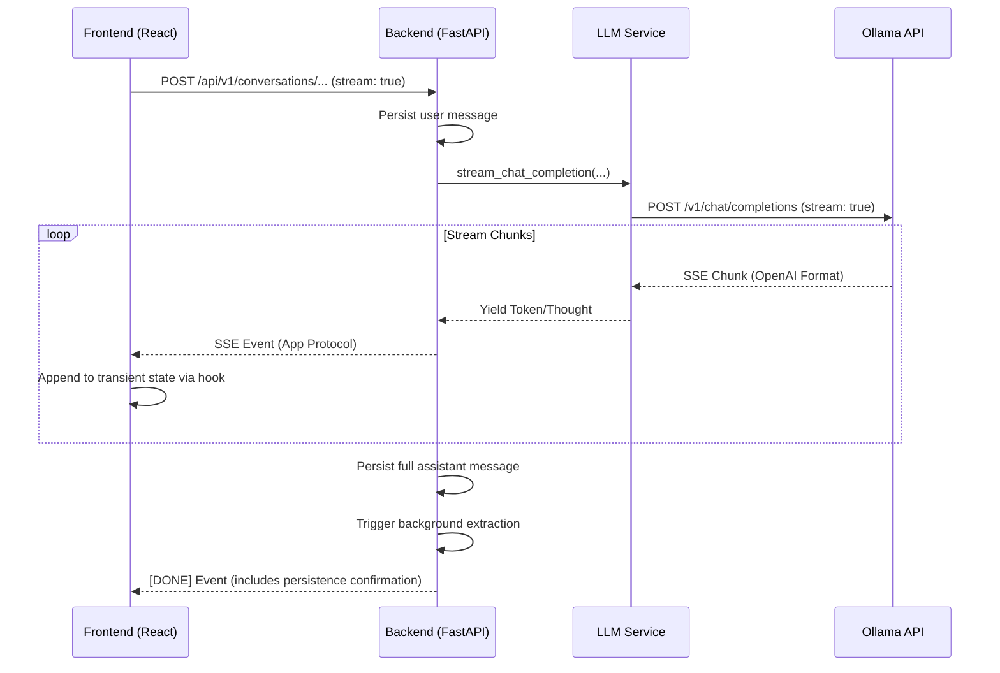

# Streaming Responses PRD

## Status

Streaming responses are now fully implemented relative to the goals in this
PRD.

Shipped behavior includes:

- SSE delivery for conversation creation and follow-up message endpoints when
  `stream: true`
- real-time `thought`, `token`, `tool_call`, `meta`, `done`, and `error`
  events
- in-stream tool execution with bounded multi-round continuation
- immediate user-message persistence and deferred assistant persistence
- persistence of reasoning traces, tool metadata, terminal failures, and
  `finish_reason`
- UI handling for thought traces, tool lifecycle state, truncation recovery via
  `Continue`, and user-initiated cancellation via `Stop`

The remaining value of this document is as an implementation record and design
reference. Any previous "remaining gaps" below have been updated to match the
shipped system.

## Summary

This document defines the implementation plan for real-time streaming
responses in Family Assistant.

The product goal is to eliminate long wait times for assistant replies,
especially for reasoning-heavy or complex models, by delivering content to
the user as it is generated.

## Product Goals

- Support real-time streaming of assistant responses in the chat UI.
- Use Server-Sent Events (SSE) for efficient, one-way streaming from
  backend to frontend.
- Maintain support for tool calling and background memory extraction
  within the streaming flow.
- Provide a responsive UI that handles partial content, thought traces,
  and final completion states.
- Ensure messages are correctly persisted to Postgres once the stream is
  complete.

## Non-Goals

- Implementing full bidirectional WebSockets (not needed for this use
  case).
- Refactoring the entire database schema (streaming metadata can live in
  the existing `annotations` or metadata fields).
- Supporting multi-user collaborative editing of the same stream.

## Problem Statement

Before this work, the backend was entirely non-streaming. When a user sent a
message:
1. The backend makes a blocking call to the LLM.
2. The LLM generates the full response (often taking 10-60+ seconds).
3. The backend returns the final result.
4. The user sees a loading spinner for the entire duration.

This leads to a poor user experience, especially with local models or
reasoning modes (like "Thinking" mode) where the time-to-first-token is
high.

## Key Technical Observations

### Server-Sent Events (SSE) are the right fit
Since the assistant response is a one-way stream of data from the server
to the client, SSE is simpler to implement and maintain than WebSockets
while being more efficient than long polling.

### Tool calls must be handled carefully
Streaming complicates tool-calling loops. The system must decide when to
emit tokens to the user and when to pause for tool execution.
The shipped implementation streams reasoning/content until a tool call is
identified, executes the tool, and then continues streaming the next turn.

### Persistence distinguishes user vs. assistant messages
To maintain a consistent history while preserving failure recovery semantics,
the user message is persisted to the canonical Postgres database as soon as
the request is accepted, while the assistant message is persisted after the
stream reaches a terminal state.
- **User Message Persistence:** Persist the user turn immediately so the
  conversation history is durable even if generation or streaming fails.
- **Assistant Message Persistence:** Persist the assistant turn when the
  stream successfully completes, including the final assembled content.
- **Reasoning Persistence:** The full reasoning trace (if generated) is
  persisted in the `thought` field within the message's `annotations` JSON
  object.
- **Error Handling:** If the stream is interrupted after assistant output has
  begun, persist an assistant message in a terminal error state with an
  `error` field and any content received before the interruption.

### Streaming reasoning vs. content
For models that emit reasoning traces (like DeepSeek-R1 or Gemma thinking),
the stream should distinguish between thought tokens and final content
tokens so the UI can render them differently.

## Proposed Solution

### Backend: Streaming LLM Service
Refactor `LLMService` to support a streaming mode that yields tokens from
the Ollama/OpenAI API.

### Backend: Streaming Conversation Service
Update existing endpoints to return a `StreamingResponse` (FastAPI) when
the request body includes `stream: true`.

Affected endpoints:
- `POST /api/v1/conversations/with-message`
- `POST /api/v1/conversations/{id}/messages`

### Backend: Event Protocol
Define the authoritative SSE event protocol for frontend and backend
implementations:

- `thought`: Partial reasoning trace token intended for thought-trace UI.
- `token`: Partial assistant content token intended for the final visible
  response.
- `tool_call`: Metadata about a tool being executed.
- `done`: Final completion metadata, including full content for
  persistence and the finalized message ID.
- `error`: Terminal failure information.

Reasoning traces must be emitted as `thought` events, while user-visible
response text must be emitted as `token` events.

### Frontend: Streaming API Client
Update the frontend API client (e.g., using `fetch` with `ReadableStream`)
to consume the SSE stream and update the application state in real-time.

### Frontend: UI Feedback
Update `Chat.tsx` and `ConversationsChat.tsx` to:
- Show an active streaming state for the latest assistant message.
- Render content as it arrives.
- Distinguish between reasoning traces and final content.
- Let the user stop an active stream without leaving the conversation.

## Architecture Changes

### New concepts
- `StreamingLLMService`
- `SSEProtocol`
- `StreamingState` (Frontend)

### Existing areas touched
- `apps/assistant-backend/src/assistant/services/llm_service.py`
- `apps/assistant-backend/src/assistant/services/conversation_service.py`
- `apps/assistant-backend/src/assistant/routers/conversations.py`
- `apps/assistant-ui/src/lib/api.ts`
- `apps/assistant-ui/src/hooks/useStreamingConversation.ts`
- `apps/assistant-ui/src/components/ConversationsChat.tsx`

## Rollout Plan

### Phase 1: Models & Parsing (Backend)
- **PR 1:** Add `ChatCompletionStreamResponse` models and the `StreamParser` utility
  to handle reasoning/content detection.

### Phase 2: LLM Service Refactor (Backend)
- **PR 2:** Refactor `LLMService` to unify request construction and implement the
  `stream_messages` generator.

### Phase 3: SSE Infrastructure (Infrastructure)
- **PR 3:** Implement the `SSEEncoder` utility and a debug endpoint to verify the
  delivery pipeline.

### Phase 4: Streaming Hook (Frontend)
- **PR 4:** Implement the `useStreamingConversation` custom hook to encapsulate SSE
  consumption and transient state management.

### Phase 5: Conversation Lifecycle (Backend)
- **PR 5:** Implement the full streaming lifecycle in `ConversationService`,
  including immediate user message persistence and deferred assistant persistence.

### Phase 6: UI Integration (Frontend)
- **PR 6:** Integrate the streaming hook into the main Chat UI and add styling for
  thought traces.

### Phase 7: Streaming Tool Loop (Backend + Frontend)
- **PR 7:** Implement true tool execution during streaming turns (not just `tool_call`
  event emission), including:
  - Execute tool calls emitted by the streaming LLM response.
  - Feed tool results back into the LLM and continue streaming assistant output.
  - Persist executed tool metadata in annotations for the final assistant message.
  - Emit reliable `tool_call` lifecycle events (`requested`, `running`, `completed`,
    `failed`) so the UI can show truthful state.
  - Keep persistence guarantees: user message immediate, assistant message deferred to
    terminal state.

## Current Status

The implementation now covers the original product goals:

- **Streaming delivery is live:** conversation endpoints support JSON or SSE
  delivery, selected by the request body's `stream: true` flag.
- **Streaming tool execution is complete:** tool calls detected during
  streaming are executed in-stream, tool results are fed back into the LLM,
  and the assistant turn continues until a terminal state.
- **Persistence lifecycle is complete:** the user turn is persisted
  immediately; the assistant turn is persisted only when the stream reaches a
  terminal success, cancellation, or error state.
- **Token-limit handling is live:** `finish_reason` is captured, persisted, and
  surfaced in the UI, including `Continue` affordances for
  `finish_reason=\"length\"`.
- **Cancellation support is live:** the frontend can stop an active stream,
  which aborts the SSE request and lets the backend persist partial output in a
  terminal error state when needed.
- **Test coverage exists across layers:** backend router/service tests and
  frontend integration tests cover successful streams, tool calls,
  interruptions, cancellation, terminal errors, and `done` payload handling.
- **Operational guidance exists:** the backend expects an OpenAI-compatible
  `/v1/chat/completions` endpoint for both non-streaming and streaming
  completions.

## Testing Strategy

- **Backend:** Mock LLM streams and verify SSE event sequence.
- **Backend:** Test persistence of interrupted streams.
- **Frontend:** Verify UI responsiveness during streaming.
- **Frontend:** Test reconnection/error handling for dropped streams.
- **Frontend:** Test user-initiated cancellation through the visible `Stop`
  control.

## Open Questions & Proposed Answers

### Endpoint Strategy
**Question:** Should we use the existing POST endpoint or a new `/stream` path?

**Recommendation:** Use the existing `POST` endpoints (e.g.,
`/api/v1/conversations/{id}/messages`) and toggle streaming behavior based on a
`stream: true` field in the request body.
- **Why:** Keeps the API surface clean. The resource being created (a message) is
  the same; only the delivery mechanism changes.

### Handling "Thinking" Tokens
**Question:** How should we handle "Thinking" tokens from Ollama vs. manual tags in the stream?

**Recommendation:** The SSE protocol should include a specific `thought` event
type.
- **Implementation:** For models like DeepSeek-R1, the backend will detect the
  start/end of reasoning blocks (either via native fields or tags) and emit
  them as `thought` events. Standard content will be emitted as `token` events.

### Cancellation Support
**Question:** Do we need to support stopping/canceling an active stream from the UI?

**Recommendation:** Yes.
- **Implementation:** If the frontend closes the SSE connection, the backend
  should detect the `ClientDisconnect` (standard in FastAPI/Starlette) and
  cancel the underlying LLM request to save local compute resources. The
  shipped UI exposes this behavior through a visible `Stop` button while a
  response is streaming.

## Technical Flow & Wiring

### End-to-End Diagram

### Protocol Details

1.  **Ollama Support:** Ollama supports streaming natively via its OpenAI-compatible
    `/v1/chat/completions` endpoint. By setting `stream: true`, Ollama emits standard
    SSE chunks.
2.  **Backend Passthrough:**
    - **LLMService:** Uses `httpx.AsyncClient.stream()` to consume Ollama's stream.
    - **StreamParser:** A dedicated utility parses raw chunks into `thought` vs
      `content` segments, shielding the transport layer from model-specific
      tags/fields.
3.  **App-Level SSE:** The `ConversationService` wraps the generator in a FastAPI
    `StreamingResponse`. It translates raw LLM chunks into our structured app
    events:
    - `thought`: For reasoning tokens.
    - `token`: For user-facing content.
    - `error`: Typed error detail for mid-stream failures.
    - `done`: Final metadata, complete content, and persistence confirmation.

## References

- **Ollama OpenAI Compatibility:** [https://ollama.com/blog/openai-compatibility](https://ollama.com/blog/openai-compatibility)
- **FastAPI StreamingResponse:** [https://fastapi.tiangolo.com/advanced/custom-response/#streamingresponse](https://fastapi.tiangolo.com/advanced/custom-response/#streamingresponse)
- **MDN: Using Server-Sent Events:** [https://developer.mozilla.org/en-US/docs/Web/API/Server-sent_events/Using_server-sent_events](https://developer.mozilla.org/en-US/docs/Web/API/Server-sent_events/Using_server-sent_events)
- **HTTPX Streaming:** [https://www.python-httpx.org/advanced/streaming/](https://www.python-httpx.org/advanced/streaming/)
- **Ollama API Documentation (Native NDJSON):** [https://github.com/ollama/ollama/blob/main/docs/api.md#generate-a-chat-completion](https://github.com/ollama/ollama/blob/main/docs/api.md#generate-a-chat-completion)
